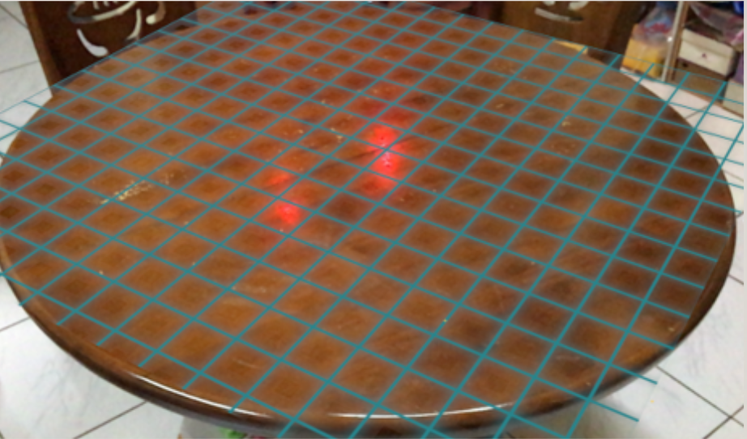
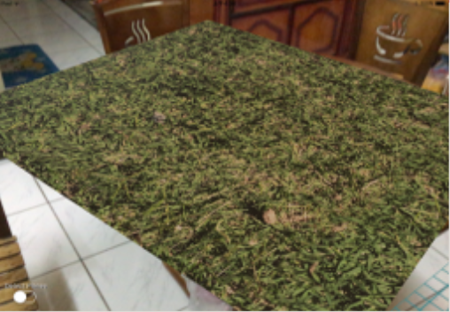
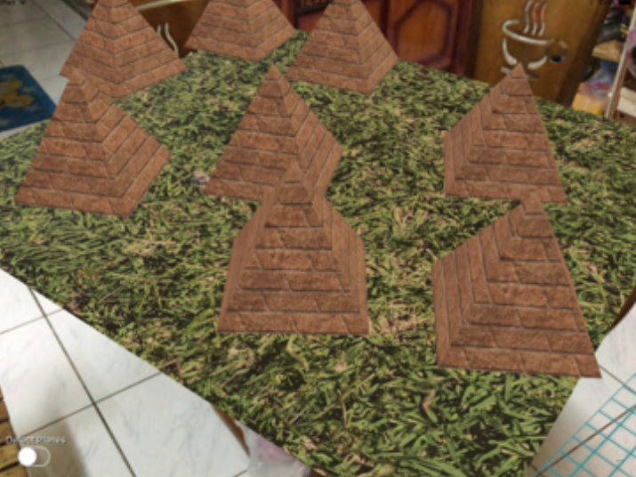

# BeautyWorld

This is an iOS app about AR art.   
The virtual objectS can interact with people.   
For example, we have built dominals which can be arranged by user and music trees which can grow with the amplitude of the music.  

Seach plane in real world.  

Put on plane texture.  

Place virtual object.  

